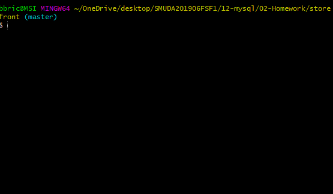
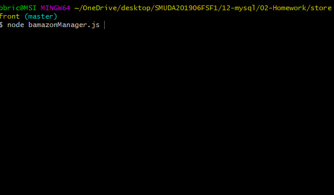

# Storefront
## About
    This project is a mock store application that has a consumer side and a manager side. The consumer will be able to look at all the products for sale and select one to purchase, then will be given the price. The Manager can view products, see low inventories, update inventories, and add new products.
## How to use
    This project is a node aplication that uses inquirer and mySQL, before starting your application run the schema in mySQL to create your database. Once the database is created run 'node bamazonCustomer.js' to open the customer side, and 'node bamazonManager.js' to run the manager side. 
## Purpose
    This application's purpose is to represent a basic understanding of node and mySQL.
## Example:

### Example of "Purchasing":

### Example of Out of Stock:

### Example of Manager Menu:

